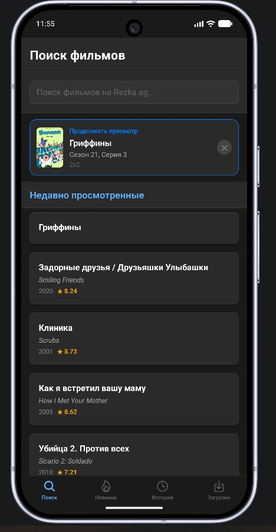

# Rezka Grabber

A React Native (Android) app for searching, watching and downloading movies/series from rezka.ag directly on your device.



## Features

- **Search** movies and series by title
- **New releases** feed with category filtering
- Multiple dubbing/translation options
- Season and episode selection for series
- Built-in video player with fullscreen support
- Auto-play: automatically advances to the next episode
- Next episode pre-loading for seamless playback
- **Offline downloads** — grab HLS streams to the device and watch them in the built-in offline player
- **Sleep timer** — stop playback after a chosen interval or at the end of the episode
- Watch history and "Continue watching" shortcut
- **Watched** and **Blacklist** lists to keep track of and hide titles

## Build & Tooling

This is a **bare / prebuild React Native project**: the native `android/` folder is committed and the app is built with **Gradle**, *not* with Expo Go or EAS. Expo SDK modules are used as libraries, but there is no managed-workflow QR/Expo Go flow.

> Only **Android** is wired up (there is no `ios/` folder). Building for iOS would require running a prebuild and a macOS/Xcode toolchain.

## Requirements

- Node.js 18+
- JDK 17
- Android SDK + platform tools (Android Studio recommended)
- Gradle is provided via the wrapper (`android/gradlew`, Gradle 8.14.3) — no separate install needed

## Setup

```bash
npm install
```

## Running (development)

Start the app on a connected device/emulator. This bundles the JS through Metro and installs a debug build via Gradle:

```bash
npm run android
```

Equivalent to running Metro + a Gradle debug install. If you prefer to drive Gradle directly:

```bash
# from the repo root
cd android
./gradlew installDebug      # build + install debug APK
# Windows: gradlew.bat installDebug
```

## Building a release APK (Gradle, not Expo)

```bash
cd android
./gradlew assembleRelease
# Windows: gradlew.bat assembleRelease
```

The signed APK is written to:

```
android/app/build/outputs/apk/release/app-release.apk
```

> **Signing:** the release build is currently signed with the bundled **debug keystore** (see `android/app/build.gradle`). For a production/distributable build, generate your own keystore and update the `signingConfigs.release` block — see https://reactnative.dev/docs/signed-apk-android.

To produce an Android App Bundle instead:

```bash
cd android
./gradlew bundleRelease
# output: android/app/build/outputs/bundle/release/app-release.aab
```

## Tests

```bash
npm test            # run once
npm run test:watch  # watch mode
npm run test:coverage
```

## How to Use

### 1. Search
Type a movie or series title in the **Поиск** (Search) tab and run the search. Results appear as cards with poster, title, and year.

### 2. New Releases
The **Новинки** (New Releases) tab shows the latest titles and can be filtered by category.

### 3. Continue Watching
If you have a watch history, a **Continue Watching** banner appears at the top of the search screen. Tap it to resume from the last watched episode.

### 4. Player Screen
Tap any result to open the player. Before playback starts:

| Step | What to do |
|------|-----------|
| **Translation** | Pick a dubbing/subtitle track from the horizontal list |
| **Season** | Select a season (series only) |
| **Episode** | Select an episode (series only) |
| **Load** | Tap **Load video** — the app fetches and plays the stream |

- The player retries automatically up to 5 times if a stream URL fails.
- A quality badge (e.g. `1080p`) is shown in the top-right corner of the video.

### 5. Auto-play & Sleep Timer
Toggle **Auto-play** to start the next episode automatically when the current one ends. Use the **sleep timer** to stop playback after a set interval or at the end of the current episode.

### 6. Downloads
Save an HLS stream from the player to the device. Downloaded titles live in the **Загрузки** (Downloads) tab and play through the built-in offline player — no network required.

### 7. History, Watched & Blacklist
Every successfully loaded video is saved to history. You can mark titles as **watched** or add them to a **blacklist** to hide them from listings.

## Project Structure

```
src/
├── components/
│   ├── MovieCard.tsx           # Search result card
│   ├── MovieGridCard.tsx       # Grid card (new releases)
│   └── SleepTimerMenu.tsx      # Sleep timer UI
├── context/
│   └── TimerContext.tsx        # Sleep timer state
├── constants/
│   └── categories.ts           # New-releases categories
├── screens/
│   ├── SearchScreen.tsx        # Search + history
│   ├── NewReleasesScreen.tsx   # New releases feed
│   ├── HistoryScreen.tsx       # Watch history
│   ├── DownloadsScreen.tsx     # Offline downloads
│   ├── SettingsScreen.tsx      # Settings
│   ├── BlacklistScreen.tsx     # Hidden titles
│   ├── WatchedScreen.tsx       # Watched titles
│   ├── PlayerScreen.tsx        # Video player + selectors
│   ├── OfflinePlayerScreen.tsx # Plays downloaded streams
│   └── DebugWebViewScreen.tsx  # WebView debugging
├── services/
│   ├── rezkaService.ts         # HTML parsing & stream URL extraction
│   ├── downloadService.ts      # Download management
│   ├── hlsDownloader.ts        # HLS segment downloading
│   ├── historyService.ts       # Watch history (AsyncStorage)
│   ├── watchedService.ts       # Watched list
│   └── blacklistService.ts     # Blacklist
├── types/
│   ├── Movie.ts
│   ├── Stream.ts
│   └── navigation.ts
└── utils/
    ├── streamParser.ts         # Stream URL decoding
    └── vttParser.ts            # Subtitle (VTT) parsing
```

## Tech Stack

| Package | Purpose |
|---------|---------|
| React Native 0.81 | Cross-platform mobile framework |
| Expo SDK 54 modules | Native modules (file system, media library, screen orientation, etc.) — bare workflow |
| React Navigation 7 | Bottom tabs + native stack navigation |
| react-native-video | Video playback |
| react-native-webview | WebView (stream extraction / debugging) |
| axios | HTTP requests |
| htmlparser2-without-node-native | HTML parsing |
| AsyncStorage | Local history / watched / blacklist storage |

## Notes

The app parses HTML from rezka.ag. If the site changes its structure, update the parsing logic in `src/services/rezkaService.ts`.
